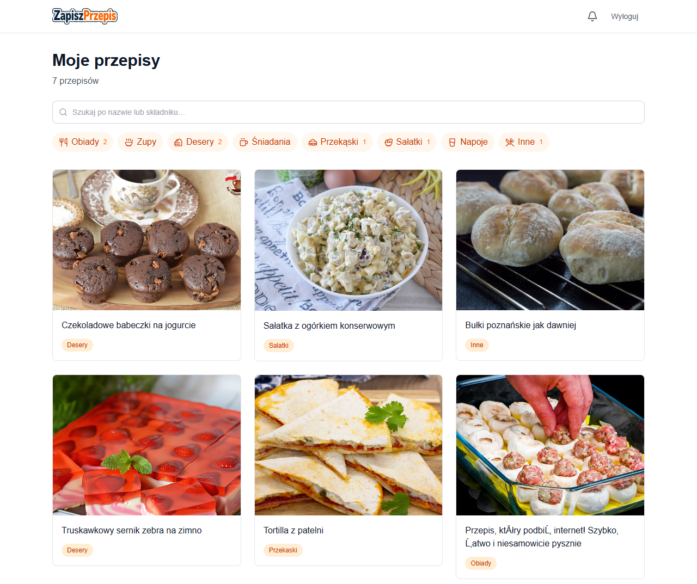
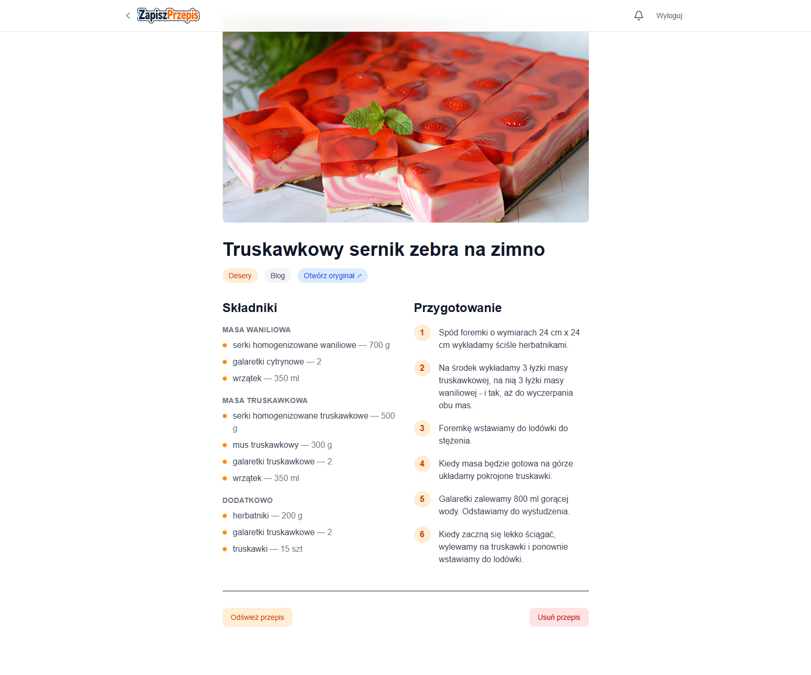
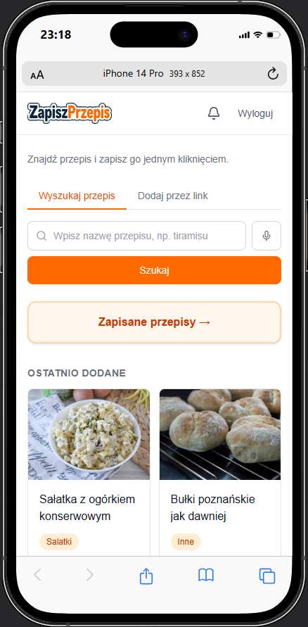
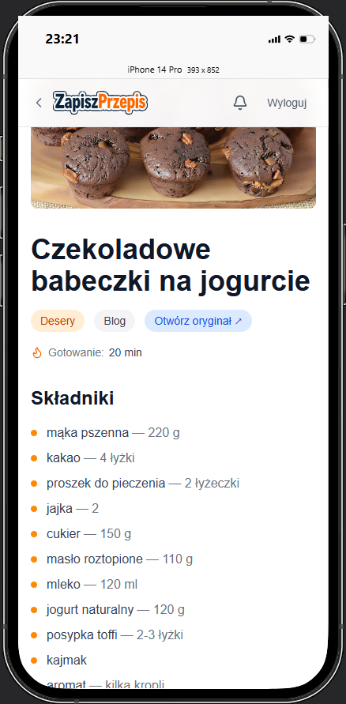

# ZapiszPrzepis

An *archive-first* PWA for saving recipes shared from social media. Every URL arrives via the system Share gesture and is transformed into a permanent, Polish-language copy of the recipe — independent of the original source.

     

**Stack:** Next.js 15 (App Router) · TypeScript · Tailwind v4 · Supabase (auth + Postgres + storage) · Inngest (async jobs) · PWA (offline + Web Share Target) · Cloudflare Workers

---

## Demo

Live app: **https://zapiszprzepis.pl**

To create a new account, enter the invite code at registration: `10XDEV`

Test account credentials: see [`context/foundation/test-accounts.md`](context/foundation/test-accounts.md)





<p align="center">
  
  &nbsp;&nbsp;
  
</p>

---

## Setup

Requirements: Node ≥ 20.6, pnpm (Corepack-managed — version pinned in `package.json#packageManager`), Supabase account, Cloudflare account.

1. **Clone and install**:
   ```bash
   git clone https://github.com/spokospace/zapiszprzepis.git
   cd zapiszprzepis
   corepack enable    # one-time — activates the pinned pnpm version
   pnpm install
   ```

2. **Create a Supabase project** at https://supabase.com/dashboard:
   - Name: `zapiszprzepis`, Region: `Central EU (Frankfurt)`, Plan: Free
   - Project Settings → API Keys → copy:
     - **Project URL** (`https://<ref>.supabase.co`)
     - **Publishable key** (or legacy `anon` `public` JWT)

3. **Configure redirect URLs** in Supabase Authentication → URL Configuration:
   - Site URL: `https://zapiszprzepis.pl`
   - Redirect URLs (allowlist):
     - `http://localhost:3000/auth/callback`
     - `https://zapiszprzepis.pl/auth/callback`

4. **Local `.env.local`**:
   ```bash
   cp .env.local.example .env.local
   # fill in NEXT_PUBLIC_SUPABASE_URL and NEXT_PUBLIC_SUPABASE_ANON_KEY
   ```

5. **Link Supabase CLI and push migrations**:
   ```bash
   pnpm exec supabase login
   pnpm exec supabase link --project-ref <ref>
   pnpm exec supabase db push --linked
   ```

---

## Background jobs (Inngest)

Recipe extraction (scraping + LLM) runs asynchronously via Inngest, outside the Cloudflare Worker request path (NFR p95 ≤ 3 min). Locally:

1. **Start the Inngest Dev Server** (separate terminal):
   ```bash
   npx inngest-cli@latest dev
   # → listens on http://localhost:8288
   ```

2. **Start Next.js dev**:
   ```bash
   pnpm dev
   ```

3. **Local dashboard**: http://localhost:8288 — "Runs" tab shows execution history

**Local secrets** (`.env.local`):
```
INNGEST_EVENT_KEY=...     # Inngest Dashboard → Event Keys
INNGEST_SIGNING_KEY=...   # Inngest Dashboard → Signing Keys
```

**Deployment**:
```bash
pnpm deploy   # deploys the Worker to Cloudflare (Inngest connects via /api/inngest)
```

---

## Progressive Web App (PWA)

Installable on Android (Chrome/Edge), Windows, and macOS. Offline-capable with Web Share Target API.

**Installation**:
- **Android**: Chrome → menu (⋮) → "Install app" — opens full-screen
- **Windows/macOS**: available in Start / Launchpad after adding to shelf
- **iOS**: web clip only (Safari PWA limitations)

**Web Share Target** (system Share gesture):
- Android: System → Share → ZapiszPrzepis → form (title + text + URL)
- Supported formats: `text/plain`, `text/uri-list`
- POST `/share` → processes URL → recipe appears in list

**Service Worker & Offline**:
- Static assets (.js, .css, .woff2, images): cache-first, 30-day revalidate
- API routes (`/api/*`): network-first, 3 s timeout, fallback to cache
- HTML pages: network-first, fallback to stale cache or home (`/`)
- Web Share Target: always network (no cache)

---

## Development

```bash
pnpm dev              # http://localhost:3000
pnpm build            # production build
pnpm lint             # ESLint
pnpm test             # Vitest unit tests
pnpm check:auth       # smoke test: ping Supabase auth/v1/health
```

---

## Auth architecture

- **`src/middleware.ts`** — refreshes the session via `supabase.auth.getUser()` on every request; redirects unauthenticated users to `/login`.
- **`src/lib/supabase/{server,client,proxy}.ts`** — three Supabase client helpers with `getAll`/`setAll` cookie adapter.
- **`src/app/login/`** — Server Component + Server Action (`signInWithEmail` — magic-link OTP).
- **`src/app/signup/`** — invite-code gated registration.
- **`src/app/auth/callback/`** — Route Handler (`exchangeCodeForSession` with error mapping).
- **`supabase/migrations/`** — baseline: `pg_trgm` + `public.current_user_id()` + RLS policies.

---

## Project context

Full PRD, roadmap, and implementation plans live in `context/`:

- `context/foundation/prd.md` — Product Requirements Document
- `context/foundation/roadmap.md` — feature map F-01 … S-09
- `context/foundation/tech-stack.md` — stack rationale
- `context/foundation/test-plan.md` — risk-based quality contract
- `context/changes/<change-id>/` — per-change folder with plan and progress
