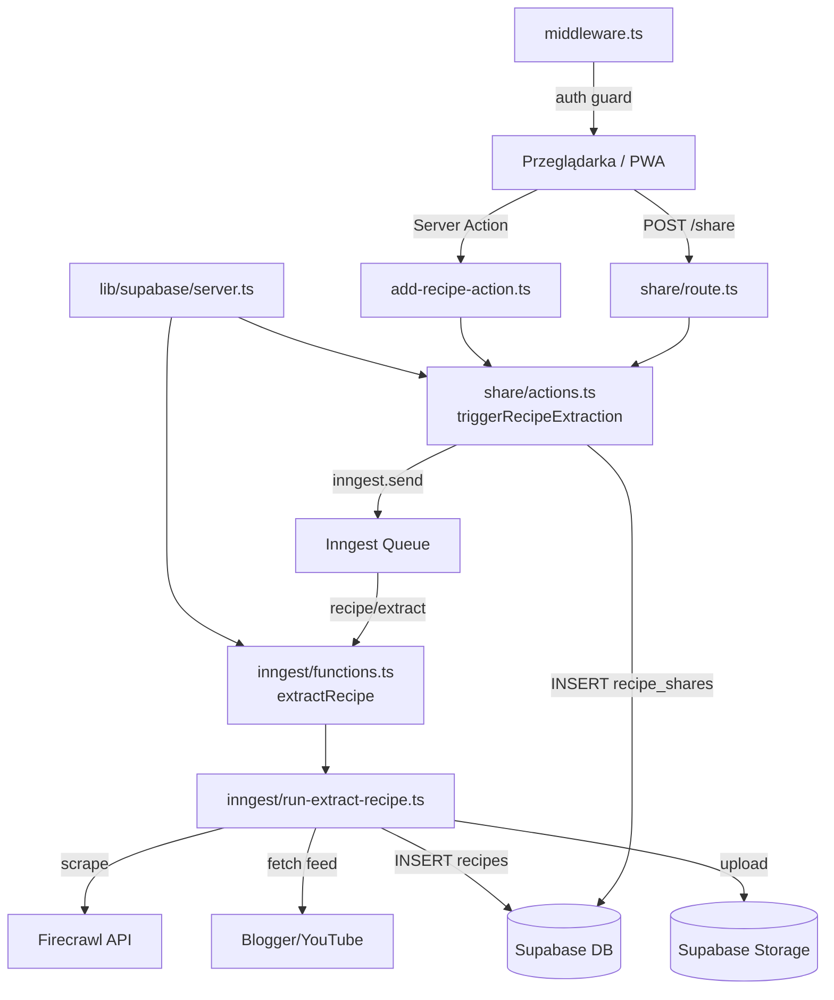

# Repo Map — zapiszprzepis

> Synteza na podstawie: artifact-1-territory.md, artifact-2-structure.md, artifact-3-contributors.md  
> Data: 2026-07-06 | Historia: 218 commitów, maj–lipiec 2026 | Autorzy: 1 (Szymon)

---

## TL;DR

`zapiszprzepis` to PWA do zapisywania przepisów kulinarnych z polskiego internetu — użytkownik udostępnia link z telefonu, pipeline AI wyciąga przepis i zapisuje go w bazie. Architektura ma cztery warstwy: Next.js App Router (UI + Server Actions) → Inngest (kolejka async) → biblioteka ekstrakcji (`src/lib/`) → Supabase (baza + storage). Cały aktywny ruch koncentruje się w `src/inngest/functions.ts` (najczęściej zmieniany plik) i `src/app/(authenticated)/recipes/` (centrum grawitacji UI). Projekt ma jednego autora i ~3 miesiące historii — jest szybki, ale wiedza architektoniczna jest skoncentrowana w jednej głowie i kilku plikach `context/`. Główny ból: `run-extract-recipe.ts` to fat function 350+ linii, która rośnie przy każdym nowym typie źródła.

---

## Teren

### Moduły według odpowiedzialności

| Moduł | Odpowiedzialność | Status |
|---|---|---|
| `src/inngest/` | Asynchroniczny pipeline ekstrakcji przepisów | **Aktywny — gorący** |
| `src/app/(authenticated)/recipes/` | Główny widok: lista, szczegóły, akcje użytkownika | **Aktywny — gorący** |
| `src/app/share/` | Web Share Target API — wejście z systemu udostępniania | **Aktywny — stabilizuje się** |
| `src/app/components/` | Komponenty współdzielone (recipe-card, category-filter, search) | **Aktywny** |
| `src/lib/` | Biblioteka ekstrakcji: Firecrawl, Blogger, YouTube, dedup, jakość treści | **Aktywny** |
| `src/lib/supabase/` | Fabryki klientów Supabase (server, client, proxy) | **Stabilny** |
| `src/middleware.ts` | Route guard — auth, Inngest bypass, Share bypass | **Stabilny** |
| `src/app/login/`, `signup/`, `forgot-password/`, `reset-password/` | Flow uwierzytelniania | **Zamrożony** (zbudowany w czerwcu, brak aktywności w lipcu) |
| `src/app/page.tsx` | Strona główna — agregator linków i form | **Aktywny (UI)** |
| `supabase/migrations/` | Migracje schematu DB | **Punktowy** (1 migracja per funkcja) |

### Klasyfikacja głębokość / stabilność

- **Głęboki, niestabilny**: `run-extract-recipe.ts` — najważniejszy, najczęściej zmieniany, najmniej testowalny przez size
- **Głęboki, stabilny**: `lib/supabase/server.ts`, `middleware.ts`, `lib/url-normalize.ts`
- **Płytki, aktywny**: `recipes/recipes-content.tsx`, `app/components/*`
- **Płytki, zamrożony**: auth pages (`login/`, `signup/`, `reset-password/`)

---

## Realne powiązania

### Co zmienia się razem (sygnał ze wspólnych commitów)

| Para | Siła | Interpretacja |
|---|---|---|
| `src/app/(authenticated)` ↔ `src/app/components` | 35 commitów | Widok listy przepisów i komponenty są jednym konceptem — refaktor jednego zawsze rusza drugie |
| `src/app/(authenticated)` ↔ `src/app/share` | 22 commity | Model przepisu (jak jest reprezentowany) rządzi oboma |
| `src/inngest/functions.ts` ↔ `src/lib/firecrawl.ts` | 5 commitów | Każda zmiana w pipeline scraping rusza oba; sprzężeni producent/konsument |
| `src/app/share/actions.ts` ↔ `src/inngest/client.ts` | bezpośredni import | Server Action zna kolejkę — celowe, ale tworzy ścisłe sprzężenie |
| `reset-password/` ↔ `forgot-password/` | 21 commitów | Słuszne sprzężenie — dwa etapy jednego flow |

### Naruszenia warstw

1. **`share/actions.ts` importuje `inngest/client`** — Server Action wywołuje bezpośrednio brokera kolejki. Celowe (dokumentacja to potwierdza), ale utrudnia podmianę Inngest.
2. **`lib/supabase/server.ts` zawiera `redirect()`** — funkcja pomocnicza na poziomie lib wykonuje efekt uboczny nawigacyjny. Trudna do testowania jednostkowego.
3. **`functions.ts` używa service-role key** — Inngest pomija RLS. Kontrolowane, ale ryzyko jeśli logika `run-extract-recipe.ts` ma bug — ma pełny dostęp do DB.

---

## Strefy ryzyka

| # | Strefa | Plik(i) | Dlaczego boli |
|---|---|---|---|
| 1 | **Fat function pipeline** | `src/inngest/run-extract-recipe.ts` | 350+ linii, wszystkie typy źródeł (FB/YT/Blogspot/web) w jednej funkcji; każdy nowy typ źródła rozrasta ten plik i zwiększa ryzyko regresji |
| 2 | **Brak adaptera LLM/Firecrawl** | `src/lib/firecrawl.ts` + inline w `run-extract-recipe.ts` | URL, format odpowiedzi i logika retry zakodowane inline; zmiana providera = przepisanie środka pipeline |
| 3 | **Service-role key w pipeline** | `src/inngest/functions.ts` | Inngest worker ma pełny dostęp do DB (obejście RLS); bug w ekstrakcji może zapisać śmieci do dowolnej tabeli |
| 4 | **Brak abstrakcji event bus** | `src/app/share/actions.ts` | `inngest.send()` wywołane bezpośrednio z Server Action — wymiana Inngest na inny broker wymaga edycji pliku biznesowego |
| 5 | **Wiedza o migracji Trigger.dev→Inngest tylko w commit message** | `src/inngest/` | Brak design doc; przyczyna wyboru Inngest (serverless compatibility) ginie jeśli message zostanie zapomniane |
| 6 | **`recipes-content.tsx` sprzężony z komponentami** | `src/app/(authenticated)/recipes/recipes-content.tsx` | 17 edycji; każda zmiana UI listy przepisów rusza ten plik + `src/app/components/*` — brak izolacji |

---

## Kogo zapytać

Jedyny autor: **Szymon** — wszystkie obszary.

Zastępstwo wiedzy architektonicznej (jeśli Szymon niedostępny):

| Obszar | Gdzie szukać wiedzy |
|---|---|
| Pipeline ekstrakcji | `context/changes/testing-inngest-orchestration/plan.md`, `context/archive/2026-06-15-test-pure-pipeline-units/research.md` |
| Decyzja Inngest vs Trigger.dev | Commit `915b40f` message + `context/changes/` foldery |
| Auth flow | `context/changes/` (szukaj reset-password, forgot-password change folders) |
| Exa discovery | `context/changes/` (szukaj discovery-via-exa) |
| Infrastruktura (Cloudflare, opennextjs) | `wrangler.jsonc`, commit `0dd268b` |

---

## Pierwszy dzień

Kolejność plików do przeczytania dla nowego kontrybutora:

1. **`src/middleware.ts`** — rozumiesz auth guard i jakie ścieżki są publiczne
2. **`src/app/share/actions.ts`** — rozumiesz wejście do pipeline (triggerRecipeExtraction)
3. **`src/inngest/functions.ts`** — rozumiesz jak Inngest odbiera event i wstrzykuje zależności
4. **`src/inngest/run-extract-recipe.ts`** — serce systemu; tu dzieje się cała logika ekstrakcji
5. **`src/lib/firecrawl.ts`** + **`src/lib/content-quality.ts`** — adaptery zewnętrzne i walidacja jakości
6. **`src/app/(authenticated)/recipes/page.tsx`** → **`recipes-content.tsx`** — jak wynik trafia do UI
7. **`context/foundation/test-plan.md`** — mapa ryzyk i stan testów

---

## Ograniczenia

- **Okno czasowe**: 218 commitów, maj–lipiec 2026 (~3 miesiące). Brak historii sprzed projektu — żadne "legacy" wzorce nie są widoczne.
- **Metoda**: analiza git log (współzmienność) + grep importów + ręczna inspekcja kluczowych plików. Nie użyto narzędzi do automatycznej analizy grafów (`dependency-cruiser` nieobecny).
- **Co mapa NIE mówi**: nie analizowano pełnej treści `run-extract-recipe.ts` (logika LLM call, format odpowiedzi), nie analizowano `src/lib/failed-shares.ts`, nie analizowano szczegółów Exa integration. Mapa nie zastępuje odczytu kodu — jest przewodnikiem po kolejności eksploracji.
- **Dynamiczne importy**: grep statyczny może nie wykryć importów warunkowych lub ładowanych runtime.
- **Jeden autor**: brak sygnałów z review comments, brak merge conflicts, brak „disputed design" historii w PRach.
